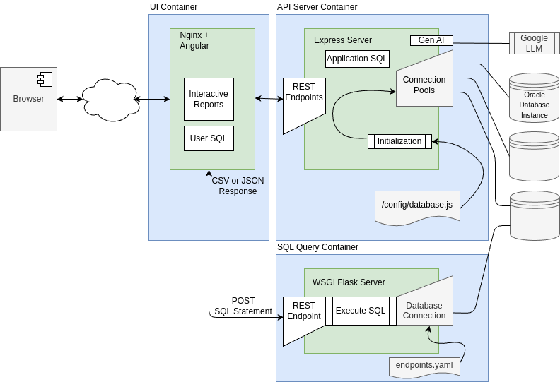
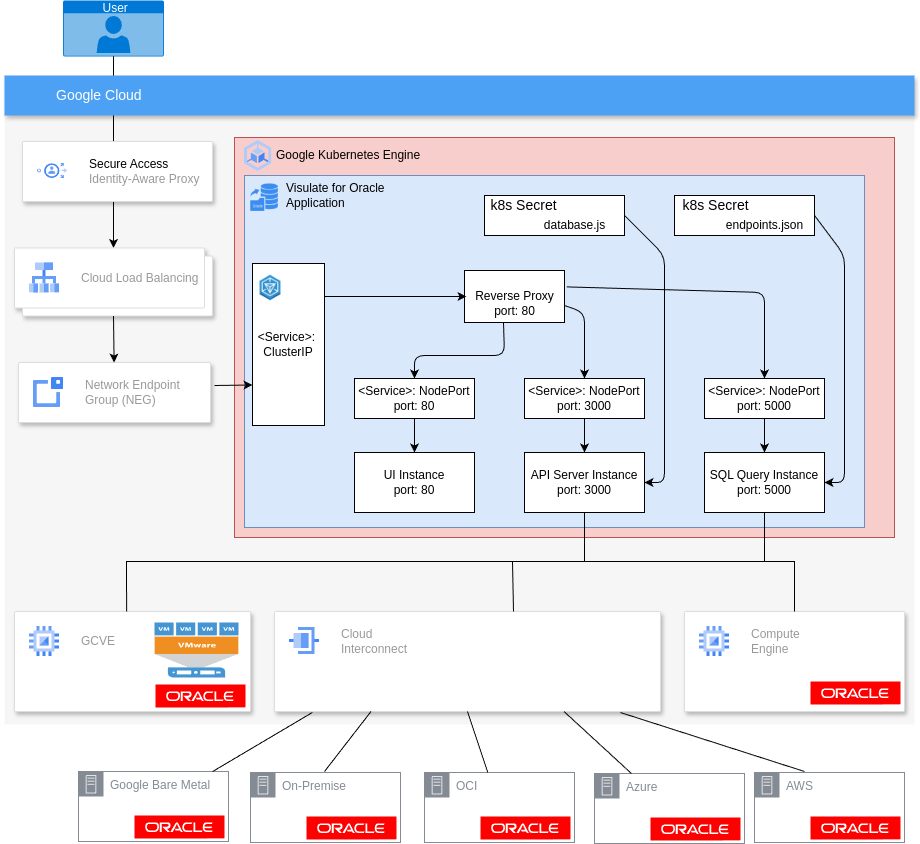

# Overview
Visulate for Oracle is a data dictionary browsing application to help data engineers understand the structure and dependencies in Oracle databases that they plan to migrate to the Cloud.

Users supply read-only connection details for one or more the databases. Visulate queries the data dictionary for each connection. Results can be viewed via a browser based UI or REST API calls. Interactive reports are generated for each database object by querying the appropriate dictionary views (e.g. DBA_TABLES and other views for table objects or DBA_SOURCE for packages)

This report also queries database's dependency model to identify dependencies to and from the object (e.g a view "uses" the tables it is based on and is "used by" a procedure that selects from it).

## Application Architecture



Visulate for Oracle creates 2 docker containers to deliver a browser UI and REST endpoints for one or more Oracle databases. The UI Container exposes an Angular UI which makes API calls to REST endpoints exposed by the API Server Container. 

The API Server is an [Express JS](https://expressjs.com/) instance.  It connects to one or more registered databases using [node-oracledb](https://oracle.github.io/node-oracledb/doc/api.html#intro). Database connections are registed by adding an entry to a configuration file that the API Server reads during initialization. It creates a [connection pool](https://oracle.github.io/node-oracledb/doc/api.html#connpooling) for each entry in the config file. A sample config file appears below.

```
const endpoints = [
 { namespace: 'oracle18XE',
    description: '18c XE PDB instance running in a docker container',
    connect: { poolAlias: 'oracle18XE',
              user: 'visulate',
              password: 'HtuUDK%?4JY#]L3:',
              connectString: 'db20.visulate.net:41521/XEPDB1',
              poolMin: 4,
              poolMax: 4,
              poolIncrement: 0
            }
  },
  { namespace: 'oracle11XE',
    description: '11.2 XE database',
    connect: { poolAlias: 'oracle11XE',
              user: 'visulate',
              password: '7>rC4P?!~U42tS^^',
              connectString: 'db20.visulate.net:49161/XE',
              poolMin: 4,
              poolMax: 4,
              poolIncrement: 0
            }
  }
];
module.exports.endpoints = endpoints;
```

## Kubernetes Architecture



Web users connect to the application via an Ingress resource. Http path rules in the ingress spec route requests to the UI or API Server as required. Database registration is performed using a Secret.  The Secret manifest delivers the database.js configuration file that the Express server reads during initialization.

### Database Registration
The initial deployment from GCP Marketplace provisions an API Server with no registered databases. The user must apply a new Secret and redeploy the API Server to register the databases they want to expose 


Download and edit the api-server-secret.yaml and api-server-deployment.yaml manifest files. Edit the secret manifest file to supply connection details for one or more databases, update the metadata name for the ConfigMap. Use `kubectl` to apply the file. Edit the deployment manifest to reference the name used in the Secret.  Apply the deployment file to rollout a new deployment with registered databases. 

#### Example
Find the API Server deployment name. (in this example the application was deployed in a namespace called 'test-ns')
```
$ kubectl get deploy --namespace=test-ns
NAME                                      READY   UP-TO-DATE   AVAILABLE   AGE
test-deployment-visulate-for-oracle-api   1/1     1            1           43h
test-deployment-visulate-for-oracle-ui    1/1     1            1           43h
```
Download the API Server deployment manifest 
```
kubectl get deploy test-deployment-visulate-for-oracle-api --namespace=test-ns -o yaml --export > deployment.yaml
```
Create a ConfigMap manifest to identify the database connections. Make a note of the metadata name (test-deployment-database-js-update in the example below) for use in the next step
```
---
apiVersion: v1
kind: Secret
type: Opaque
metadata:
  name: test-deployment-database-js-update
stringData:
  database.js: |-
    const endpoints = [
    { namespace: 'oracle18XE',
      description: '18c XE pluggable database instance running in a docker container',
      connect: { poolAlias: 'oracle18XE',
                user: 'visulate',
                password: 'HtuUDK%?4JY#]L3:',
                connectString: 'db20.visulate.net:41521/XEPDB1',
                poolMin: 4,
                poolMax: 4,
                poolIncrement: 0
              }
    },
    { namespace: 'oracle11XE',
      description: '11.2 XE database',
      connect: { poolAlias: 'oracle11XE',
                user: 'visulate',
                password: '7>rC4P?!~U42tS^^',
                connectString: 'db20.visulate.net:49161/XE',
                poolMin: 4,
                poolMax: 4,
                poolIncrement: 0
              }
    }
    ];
    module.exports.endpoints = endpoints;
```
Edit the downloaded deployment manifest. Update the configMap name with the value from the previous step.
```
apiVersion: extensions/v1beta1
kind: Deployment
metadata:
  annotations:
    deployment.kubernetes.io/revision: "1"

...

      volumes:
      - secret:
          defaultMode: 420
          secretName: test-deployment-database-js-update
        name: config-database-volume
      - emptyDir: {}
        name: logfiles
status: {}
```
Validate the edited secret and deployment manifests:
```
$ kubectl apply --dry-run --validate --namespace=test-ns -f secret.yaml 
$ kubectl apply --dry-run --validate --namespace=test-ns -f deployment.yaml 
```

Apply the secret and deployment manifests:

```
$ kubectl apply --namespace=test-ns -f secret.yaml 
$ kubectl apply --namespace=test-ns -f deployment.yaml 
```