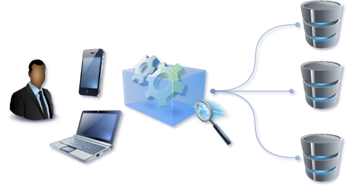

<!-- Banner -->
<section id="banner">
  

    <header>
      <h1>Oracle database catalog</h1>
      
Catalog your Oracle databases in a single location

    </header>
    
Visulate for Oracle is a Cloud-based application to browse and search Oracle databases.
    Users create connections from a central server to each database and then query them
    using REST APIs or a browser.

    <ul class="actions">
      <li><a href="/application-architecture" class="button big">Learn More</a></li>
    </ul>
  

  
    
  
</section>

<!-- Section -->
  <section>
    <header class="major">
      <h2>Features</h2>
    </header>
    

      <article>
        
        

          <h3>One tool</h3>
          
Single tool to catalog the company’s Oracle databases. No server agents to install and manage.
           No client code to download or host via Citrix. 

        

      </article>
      <article>
        
        

          <h3>Cloud-based</h3>
          
Enterprise-ready containerized solution with prebuilt deployment templates.
          Available as a Kubernetes application on Google Cloud Marketplace.
         

        

      </article>
      <article>
        
        

          <h3>Database Objects</h3>
         
Search and browse the data dictionary in each database.  Create bookmarks and links to schemas and objects.

         
Query the database's dependency model to identify dependencies to and from the object (e.g a view "uses" the tables it is based on and is "used by" a procedure that selects from it).

        

      </article>
      <article>
        
        

          <h3>DDL Download</h3>
          
Generate and download DDL for individual objects or groups of objects.

        

      </article>
      <article>
        
        

          <h3>Advanced Search and Filter</h3>
          
Single query to find objects by name in every schema and database. Filtered search to find objects in a database that match a wildcard pattern (e.g. E-Business Suite product prefix). 

Advanced search API to identify objects and their dependent objects (e.g. a find the schema definition for a stored procedure and every object it needs to install cleanly)

        

      </article>
      <article>
        
        

          <h3>API Support</h3>
          
REST APIs are available for all application features.

        

      </article>
    

  </section>

  <header class="major">
    <h2>Common use cases</h2>
  </header>

### On-Premises to Cloud migration
Document and analyze on-premises environments prior to migration. Evaluate proprietary feature usage in each database. Identify candidates for conversion to other database engines. Examine custom PL/SQL and other database related program logic (stored procedures, triggers, scripts, and so on) and re-write for the cloud.

Download the DDL to refactor a single monolithic schema for use in microservices. Find direct and indirect dependencies for objects and groups of objects. Extract SQL statements from stored procedures. Catalog and analyze Oracle database instances on Oracle Cloud Platform or other Cloud providers.

### Custom development
Document custom code in your Commercial-off-the-shelf (COTS) application database. Review the schema definitions in your E-Business Suite database. Examine dependencies before a schema change. Download and diff the DDL for objects in development and test environments.

### License management
Catalog all of your company's Oracle database instances in preparation for a compliance audit. Identify Enterprise Edition feature and option usage. Find Enterprise Edition license instances that could be be downgraded to Standard Edition 2. Review the contents of old databases. What are they really running? Identify targets for consolidation or decommissioning.

