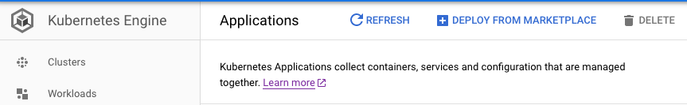

# Visulate for Oracle quickstart
This page shows you how to create a Visulate for Oracle environment on Google Cloud Platform (GCP) and connect it to an Oracle database.

## Before you begin
1. Identify or [create a Kubernetes cluster](https://cloud.google.com/kubernetes-engine/docs/quickstart) in GCP
2. Identify one or more Oracle databases that you want to document
3. Configure your firewall to allow connections from the GKE cluster to each Oracle database


## Provision a Visulate for Oracle application instance
1. Visit the [Kubernetes Engine page](https://console.cloud.google.com/projectselector/kubernetes?_ga=2.63610924.2027644729.1585254356-1471266844.1580858508) in the Google Cloud Console and create or select a project.

2. Select Applications from the left menu then click the "DEPLOY FROM MARKETPLACE" link


3. Enter Visluate in the search box 
4. **TO DO** *Screenshots and instructions when product is live on Marketplace*

## Database Setup
Create a database user for each database you want to register. Follow the instructions in the [Database Setup](database-setup.html) How-to guide.

## Test your firewall rules
Verify your firewall rules allow connections from the API Server to each database. 
1. Use `kubectl` to find the API Server pod name. Look for the pod with `-api-` in its name:  
```
$ kubectl get pods --namespace=test-nat-ns
NAME                                                            READY   STATUS    RESTARTS   AGE
test-nat-deployment1-visulate-for-oracle-api-5598f9b558-x75qj   4/4     Running   0          3d21h
test-nat-deployment1-visulate-for-oracle-ui-6dc459fd65-cqtp9    2/2     Running   0          3d21h
```
2. Open a bash shell in the pod:
```
kubectl exec -it test-nat-deployment1-visulate-for-oracle-api-5598f9b558-x75qj --namespace=test-nat-ns -- /bin/bash
```
3. Login to the database using SQL*Plus:

```
Defaulting container name to visulate-for-oracle-api.
Use 'kubectl describe pod/test-nat-deployment1-visulate-for-oracle-api-5598f9b558-x75qj -n test-nat-ns' to see all of the containers in this pod.
bash-4.2# sqlplus visulate@db11.visulate.net:1521/vis13    

SQL*Plus: Release 19.0.0.0.0 - Production on Sat Mar 28 15:46:47 2020
Version 19.5.0.0.0

Copyright (c) 1982, 2019, Oracle.  All rights reserved.

Enter password: 

Connected to:
Oracle Database 11g Release 11.2.0.4.0 - 64bit Production

SQL> 
```
## Database Registration
Follow the instructions in the [Database Registration](database-registration.html) How-to guide.

## Access the UI
**TO DO** *Screenshots and instructions when product is available on Marketplace*

## Clean up
**TO DO** *Screenshots and instructions when product is available on Marketplace*